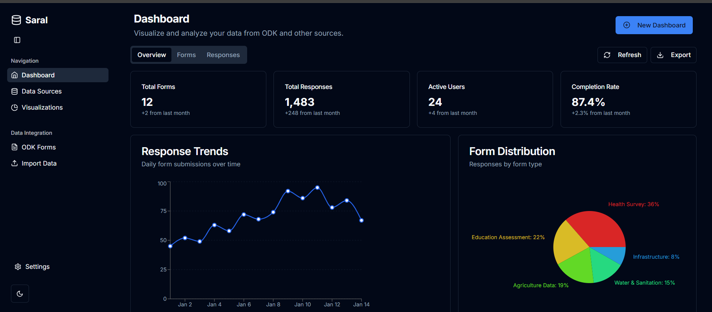

# Saral Data Integration & Dashboards - C4GT 2025

A comprehensive web application for integrating, visualizing, and managing data from external sources like ODK (Open Data Kit).



## Overview

Saral Data Integration & Dashboards is a full-stack web application built with Next.js that allows organizations to seamlessly integrate data from various sources, particularly ODK Central, and create interactive dashboards for data visualization and analysis.

## Features

- **Data Source Integration**
  - Connect to ODK Central instances
  - Import data from CSV, Excel, and JSON files
  - Configure REST API connections
  - Automated data synchronization

- **Form Management**
  - View and manage ODK forms
  - Import XForm definitions
  - Track form submissions
  - Monitor form status

- **Data Visualization**
  - Create custom visualizations
  - Multiple chart types (bar, line, pie)
  - Interactive dashboards
  - Export visualizations

- **Data Analysis**
  - Filter and sort data
  - Create custom reports
  - Track metrics and KPIs
  - Historical data comparison

- **User Management**
  - Role-based access control
  - User preferences
  - Notification settings
  - Security settings

## UI Prototype

An initial working prototype has been created using V0.dev, demonstrating the complete workflow—from registering roads with unique IDs to tagging infrastructure development and monitoring progress

🔗 **[View UI Prototype](https://kzmkwlh3654goyaznpl3.lite.vusercontent.net/)**

### Prerequisites

- Node.js 18.x or later
- npm 9.x or later

## Technologies Used

- **Frontend**:
  - Next.js 14
  - React 18
  - Tailwind CSS
  - shadcn/ui components
  - Recharts for data visualization

- **Backend**:
  - Next.js API routes
  - Node.js

- **Data Integration**:
  - Custom ODK Central API client
  - CSV/Excel/JSON parsers


## 📖 How to Run

```bash
git clone https://github.com/ManoharBari/saral.git
cd saral
npm install
npm run dev
```

## 🧑‍💻 Author

**Manohar Kale**
Full Stack Developer – MERN | CivicTech Contributor

🔗 [GitHub](https://github.com/manoharbari) • [LinkedIn](https://linkedin.com/in/manohar-kale)